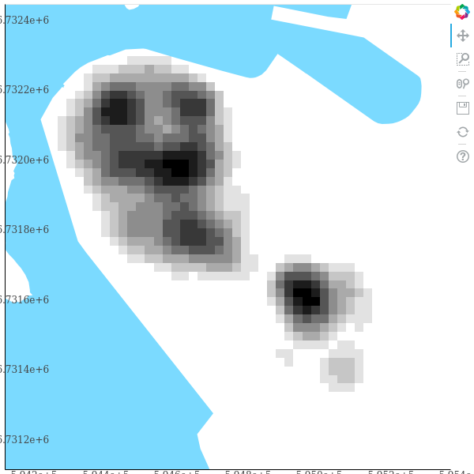
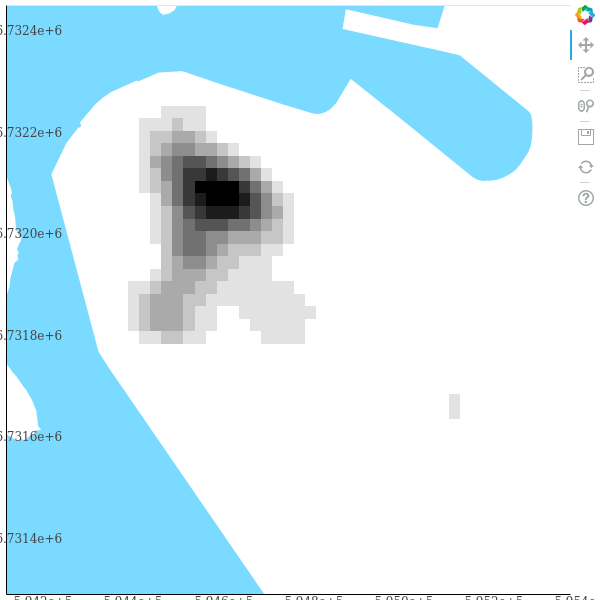
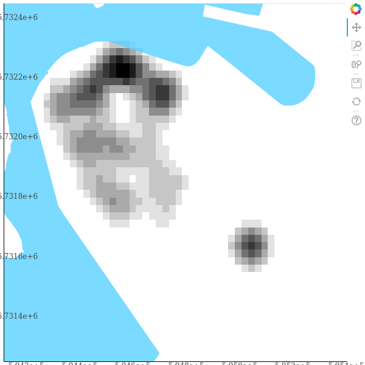

% Spatiaalinen segregaatioanalyysi ja autonomian ajan lopun uskonnolliset ryhmät
% Antti Härkönen
% 2019-10-25

# Taustaa

## Viipuri

- ruotsalainen linna vesireittien hallitsemiseen
- kaupunkioikeudet 1403

## Venäjän aika

- venäläiset valtasivat 1710
- suuri venäläinen varuskunta
- Viipurin kuvernementti liitettiin Suomen suuriruhtinaskuntaan 1812

## 1800-luku

- teollistuminen
- Saimaan kanava 1856
- Pietari-Helsinki rata 1870

## Luterilaiset

- alemmat yhteiskuntaluokat suomenkielisiä
- ruotsin- ja saksankieliset vähemmistöt

## Ortodoksit

- Venäjältä muuttaneita
- venäjänkielisiä

## 1900-luvun alku

- venäläistämistoimet vaikuttivat Viipurin läänissä eniten
- poliittinen jännitys

## Sisällissota

- ensimmäinen yhteenotto Viipurissa 19.1. 
- kaupunki punaisten hallussa melkein koko sodan

## Viipurin valtaus

- valkoiset ampuivat valtauksen jälkeen paitsi punaisia myös venäjänkielistä siviiliväestöä

# Tutkimusongelma

## Kysymykset

- kuinka segregaatio muuttui vuosien varrella
- ortodoksit vs valtaväestö

# Aineisto & Menetelmät

## Aineisto

- [henkikirjat](http://digi.narc.fi/digi/view.ka?kuid=691815)
- [tonttikartat](http://digi.narc.fi/digi/view.ka?kuid=40602614)

## Konenäkö

- [scikit-image](https://scikit-image.org/) (Python)
- kuvan puhdistaminen
- numeroiden erottaminen
- koulutusaineiston tuottaminen

## Koneoppiminen

- ohjattu syväoppiminen ([scikit-learn](https://scikit-learn.org/stable/))
- hermoverkkomalli
- lupaavia tuloksia numeroiden tunnistamisessa
- vaatii runsaasti koulutusdataa

## Segregaatioanalyysi

- spatiaalinen segregaatioanalyysi
- perinteiset aspatiaaliset indeksit 
(esim. [Index of dissimilarity](https://www.jstor.org/stable/2088328))
kärsivät [MAUPista](https://en.wikipedia.org/wiki/Modifiable_areal_unit_problem)

## Ydinestimointi

- ydinestimointi (Kernel Density Estimation, KDE)
- rasteri kuvaa väestön jakautumista kaupunkitilassa

## Spatiaalinen segregaatioindeksi S

- $S = 1 - \frac{V_{\cap}}{V_{\cup}}$
- $$V_{\cap} = \sum_{n=0}^N{min(\tilde p_{hn}, \tilde p_{gn})}$$
- $$V_{\cup} = \sum_{n=0}^N{max(\tilde p_{hn}, \tilde p_{gn})}$$

# Tiheys: Koko keskusta

## 1880

## 1900

## 1920

# Tiheys: Ortodoksit

## 1880

## 1900

## 1920

# Tuloksia

## Segregaatio

- S:n arvo laskee 1880-1900 ja nousee 1900-1920
- ortodoksien asuinalueet vaihtuvat huomattavasti

## Mitä nyt

- lisää aineistoa käyttöön
- koneoppimista parannettava
- [github.com/AnttiHaerkoenen](https://www.github.com/AnttiHaerkoenen)
